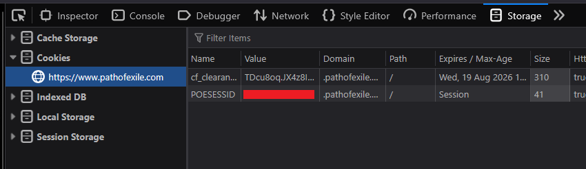
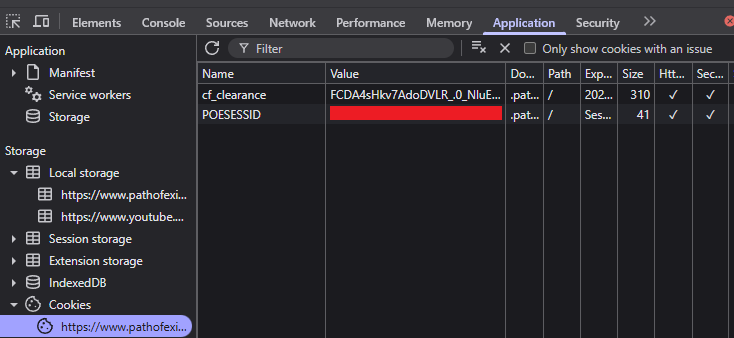
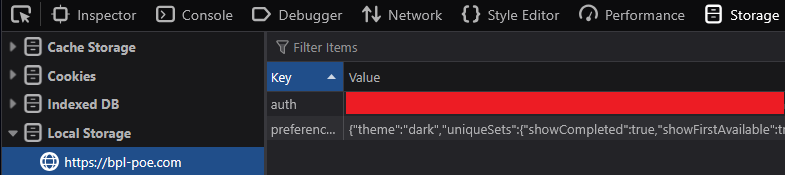
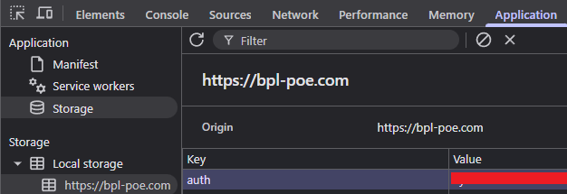

# Tools for BPL Admins

## Requirements

We need the following input Parameters:

- PoE Session ID
  - This is EXTREMELY sensitive data. In fact it's already kind of sketchy that we are asking you to give it to this tool as an input. Please check out the code to see how we are actually using it.
- BPL JWT
  - This is your token to authenticate yourself against the BPL Backend
- Guild ID
  - This is the internal ID of your guild

# How to get the parameters:

## PoE Session ID

- Navigate to https://www.pathofexile.com/
- Make sure you are logged in
- Press F12 to open dev tools
- Go to Application (Chromium) / Storage (Firefox)
- Go to Cookies for https://www.pathofexile.com/
- Select the value for POESESSID
<div>
<p> Firefox: </p>

<p> Chrome: </p>


</div>

## BPL JWT

- Navigate to https://bpl-poe.com/
- Make sure you are logged in
- Press F12 to open dev tools
- Go to Application (Chromium) / Storage (Firefox)
- Go to Local storage for https://bpl-poe.com/
- Select value for auth
<div>
<p> Firefox: </p>

<p> Chrome: </p>


</div>

## Guild ID

- Navigate to https://www.pathofexile.com/my-guild
- Click on "Stash History"
- Your Browser URL should now look like this: https://www.pathofexile.com/guild/profile/408208/stash-history
- The number between profile and stash-history is your guild id

## Private League ID

- Navigate to https://www.pathofexile.com/private-leagues
- Click view on your league
- It will be named "YourLeagueName (PL12345)
- The number after PL is your league id

## Usage

### For End Users

1. Download the latest release from the [Releases page](https://github.com/BPL-v2/tools/releases)
2. Extract the zip file for your platform
3. Run the setup script: `./setup.sh` (Linux/macOS) or run `setup.sh` in Git Bash (Windows)
4. Edit the `.env` file with your actual values (see instructions above)
5. Run the tool: `./bpl-tools` (Linux/macOS) or `bpl-tools.exe` (Windows)

### Interactive Menu

The tool provides an easy-to-use interactive menu:

- Use ↑/↓ arrow keys to navigate
- Press Enter to select
- Choose your tool, then choose run mode (once or continuous)

## Development

### Building from Source

```bash
git clone https://github.com/BPL-v2/tools.git
cd tools
go build -o bpl-tools .
```

### Creating a Release

To create a new release (for maintainers):

```bash
# Make sure all changes are committed
git add .
git commit -m "Your changes"
git push

# Create and push a release tag
./release.sh v1.0.0
```

This will automatically:

- Build binaries for all platforms (Linux, Windows, macOS Intel/ARM)
- Create zip packages with binaries, README, setup script, and .env template
- Create a GitHub release with download links
- Generate release notes with setup instructions
